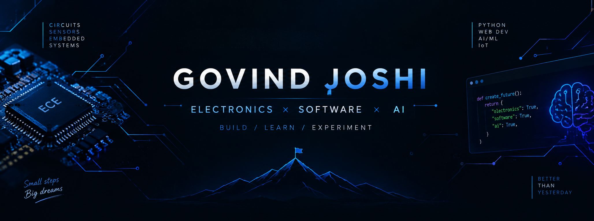

 

### `ECE STUDENT` • `DEVELOPER` • `BUILDER`

  

---

## 👨‍💻 About Me

Hi, I'm **Govind** — an Electronics & Communication Engineering student at **Lovely Professional University**.

I'm interested in building systems where **hardware and software work together**, while exploring the possibilities of AI and intelligent technology.

### ⚡ What I'm Into

- 🎓 Electronics & Communication Engineering
- 🐍 Python & programming
- 🌐 Web development
- ⚡ Embedded systems
- 📡 IoT & wireless communication
- 🤖 AI & intelligent systems
- 🚀 Building practical projects

> **I learn by building — not just by watching.**

---

## 🚀 Featured Projects

### 🩸 BloodBridge

**Python-based blood donation management system**

A beginner-friendly application designed around connecting blood donors and recipients.

**Built with:**  
`Python` `CLI` `File Handling`

---

### 🌊 Flood Detection System

**ESP8266-based water-level monitoring system**

A hardware + software project using ultrasonic sensing and ESP-NOW communication to monitor water levels.

**Built with:**  
`ESP8266` `ESP-NOW` `HC-SR04` `IoT`

---

### 🌐 Personal Portfolio

**My developer & ECE portfolio**

A personal website designed to showcase my education, projects, skills and journey.

**Built with:**  
`HTML` `CSS` `JavaScript`

---

### ⚙️ ECE Experiments

Hands-on experiments involving:

`Arduino` `Sensors` `C/C++` `Embedded Systems`

---

## 🛠️ Tech Stack

### Programming

### Web

### Tools

### Electronics & Embedded

`Arduino` • `ESP8266` • `ESP-NOW` • `HC-SR04` • `Sensors` • `IoT`

---

## 📚 Currently Learning

### 🐍 Python

Building a strong programming foundation.

⬇️

### 🌐 Web Development

Learning how to build modern websites and applications.

⬇️

### ⚡ Embedded Systems

Connecting software with real-world electronics.

⬇️

### 🤖 AI & Intelligent Systems

Exploring how intelligent software can interact with the physical world.

---

## 🎯 My Direction

### `ECE`
**↓**
### `EMBEDDED SYSTEMS`
**↓**
### `SOFTWARE`
**↓**
### `AI`
**↓**
### `INTELLIGENT SYSTEMS`

My long-term goal is to understand both sides of technology:

**the hardware that makes a system possible ⚡**

and

**the software that makes it intelligent 🧠**

---

## 📊 GitHub

  

---

## 🐍 Contribution Journey

---

## 🤝 Connect

 

### ⚡ BUILD • LEARN • EXPERIMENT • REPEAT

`Electronics` × `Software` × `AI`

